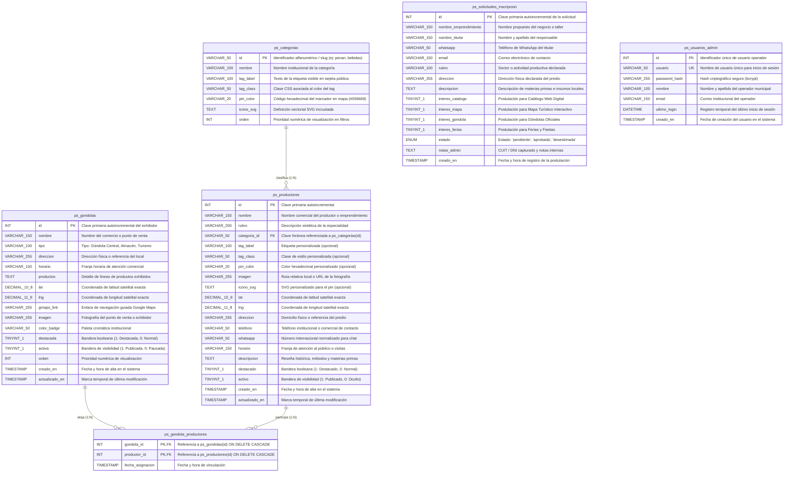
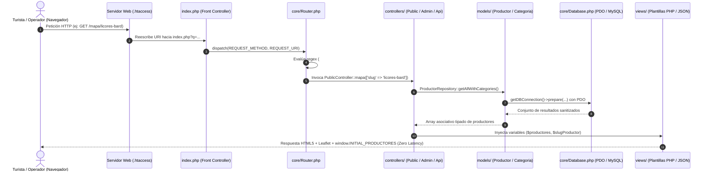

# Hecho en San José &bull; Plataforma Productiva y Cartográfica Oficial

[](https://php.net/)
[](https://www.mysql.com/)
[](https://leafletjs.com/)
[](https://www.openstreetmap.org/)
[](#-arquitectura-del-software-y-ciclo-de-vida)
[](#-seguridad-y-resiliencia-técnica)

Plataforma web integral, interactiva y de soberanía tecnológica diseñada para articular el sector productivo local con el ecosistema turístico oficial de la ciudad de **San José, Entre Ríos, Argentina** ([sanjose.tur.ar/hechoensanjose](https://sanjose.tur.ar/hechoensanjose/)).

Desarrollada bajo estándares modernos de desarrollo web, accesibilidad (WCAG 2.1 AA) y seguridad defensiva multicapa para el fomento del consumo de cercanía, visibilidad del productor regional y digitalización de trámites ciudadanos ante la **Secretaría de Educación, Cultura y Turismo de la Municipalidad de San José**.

---

## 📋 Tabla de Contenidos

1. [Objetivos Estratégicos del Programa](#-objetivos-estratégicos-del-programa)
2. [Stack Tecnológico Integral](#-stack-tecnológico-integral)
3. [Modelo Entidad-Relación (Base de Datos)](#-modelo-entidad-relación-base-de-datos)
4. [Arquitectura del Software y Ciclo de Vida](#-arquitectura-del-software-y-ciclo-de-vida)
5. [Especificación de Endpoints (API REST)](#-especificación-de-endpoints-api-rest)
6. [Estructura del Proyecto y Organización Modular](#-estructura-del-proyecto-y-organización-modular)
7. [Seguridad y Resiliencia Técnica](#-seguridad-y-resiliencia-técnica)
8. [Sistema de Diseño, UI/UX y Accesibilidad](#-sistema-de-diseño-uiux-y-accesibilidad)
9. [Padrón Oficial de Productores y URLs Semánticas](#-padrón-oficial-de-productores-y-urls-semánticas)
10. [Instalación, Configuración y Despliegue](#-instalación-configuración-y-despliegue)
11. [Documentación Complementaria](#-documentación-complementaria)

---

## 🎯 Objetivos Estratégicos del Programa

1. **Articulación Turismo + Producción Autóctona:** Visibilizar a micro y medianos productores (agroecología, nuez pecán, licores artesanales centenarios, apicultura nativa, queserías de colonia y cuchillería entrerriana) para que turistas y vecinos accedan a productos con sello de identidad de origen.
2. **Georreferenciación Satelital Precisa:** Ubicación milimétrica de cada establecimiento en el ejido urbano y colonias aledañas con coordenadas satelitales comprobadas.
3. **Comercialización Directa sin Intermediarios:** Enlace instantáneo a WhatsApp con mensaje personalizado y botón de ruta guiada paso a paso mediante GPS (Google Maps / navegador nativo).
4. **URLs Amigables y Códigos QR Oficiales:** Enlaces canónicos legibles y códigos QR limpios por productor (ej. `/mapa/licores-bard`) para packaging, botellas, frascos y cartelería turística.
5. **Soberanía y Ahorro Tecnológico:** Construido sobre tecnologías 100% abiertas (**Leaflet.js**, **OpenStreetMap**, **PHP 8** y **MySQL**), sin costos recurrentes de licencias ni límites de cuota de APIs comerciales propietarias.
6. **Homologación Digital de Nuevos Emprendimientos:** Circuito administrativo en un solo clic para convertir postulaciones ciudadanas en productores activos del padrón municipal.

---

## 🛠️ Stack Tecnológico Integral

El sistema está desarrollado bajo el principio de **cero dependencias innecesarias**, garantizando alto rendimiento, bajo consumo de recursos en hosting compartido o VPS, y máxima longevidad en el tiempo:

| Capa / Subsistema | Tecnología / Herramienta | Versión | Rol y Justificación Técnica |
| :--- | :--- | :---: | :--- |
| **Lenguaje Backend** | **PHP** | `8.0+` | Lenguaje nativo de servidor. Ejecución rápida sin overhead de frameworks pesados, con tipado estricto, manejo moderno de errores (`Throwable`) y soporte de atributos. |
| **Patrón Arquitectónico** | **MVC + Front Controller** | Custom | Desacoplamiento estricto de responsabilidades: Front Controller unificado (`index.php`), controladores por ámbito, repositorios de acceso a datos y vistas PHP limpias. |
| **Enrutamiento HTTP** | **Regex Dynamic Router** | Custom | Enrutador propio (`core/Router.php`) con soporte de rutas dinámicas mediante expresiones regulares (`/mapa/{slug}`), captura de parámetros y retrocompatibilidad total con extensiones `.php`. |
| **Motor de Base de Datos** | **MySQL / MariaDB** | `5.7+` / `10.3+` | Sistema gestor relacional con motor de almacenamiento **InnoDB** (soporte transaccional ACID y restricciones de integridad referencial con claves foráneas). |
| **Capa de Abstracción DB** | **PDO (PHP Data Objects)** | Nativo | Conexión singleton (`core/Database.php`) configurada con `ATTR_EMULATE_PREPARES => false`, `ERRMODE_EXCEPTION` y codificación forzada `utf8mb4`. |
| **Librería Cartográfica** | **Leaflet.js** | `1.9.4` | Librería JavaScript liviana y modular para mapas interactivos móviles, georreferenciación, marcadores vectoriales personalizados (`L.divIcon`) y transiciones de cámara (`flyTo`). |
| **Proveedor de Teselas** | **OpenStreetMap (OSM)** | CartoDB / OSM | Capa base de mapas de código abierto libre de costos por petición o consumo de cuotas comerciales. |
| **Estilos y Maquetación** | **Vanilla CSS3** | Nativo | Sin frameworks compilados (como Tailwind o Bootstrap). Sistema propio basado en Custom Properties (Tokens CSS), Flexbox, CSS Grid y estilos de impresión (`@media print`). |
| **Lógica del Cliente** | **JavaScript Vanilla (ES6+)** | Modern ES | Manipulación declarativa del DOM, filtrado dinámico en memoria, sincronización síncrona con inyección desde PHP (`window.INITIAL_PRODUCTORES`) y eventos táctiles. |
| **Tipografía Web** | **Google Fonts** | Hosted | Tipografía geométrica **Outfit** (titulares e identidad institucional) y **Plus Jakarta Sans** (cuerpo de texto, datos técnicos y tablas). |
| **Servidor Web** | **Apache HTTP Server** | `2.4+` | Enrutamiento por reescritura de URLs (`mod_rewrite`), inyección de cabeceras de seguridad (`mod_headers`) y compresión de activos estáticos (`mod_deflate`). |
| **Seguridad Criptográfica** | **Bcrypt / CSPRNG** | Nativo | Cifrado de contraseñas de sentido único (`password_hash`), generación de tokens de seguridad CSRF aleatorios (`random_bytes(32)`). |

---

## 🗄️ Modelo Entidad-Relación (Base de Datos)

El esquema relacional fue diseñado para normalizar las relaciones entre rubros comerciales y establecimientos, garantizando integridad referencial mediante claves foráneas y un registro transparente de auditoría temporal.

### Diagrama Entidad-Relación (Mermaid)



### Detalle de Tablas y Restricciones Técnicas

1. **`ps_categorias`**:
   - Almacena los rubros productivos oficiales del municipio.
   - Su clave primaria es de tipo `VARCHAR(50)` para permitir slugs semánticos (ej. `'pecan'`, `'bebidas'`, `'alimentos'`, `'artesania'`).
   - El campo `icono_svg` almacena la geometría vectorial optimizada (`viewBox="0 0 24 24"`) para renderizado dinámico en Leaflet.
2. **`ps_productores`**:
   - Contiene la información geográfica y comercial de los establecimientos homologados.
   - Las columnas `lat` y `lng` utilizan `DECIMAL(10, 8)` y `DECIMAL(11, 8)` respectivamente, garantizando una precisión satelital submétrica (resolución milimétrica apta para navegación GPS).
   - Posee una clave foránea `fk_ps_productores_categoria` apuntando a `ps_categorias(id)` con regla `ON UPDATE CASCADE`.
   - Índices secundarios en `categoria_id` y `activo` para acelerar consultas de filtrado en el catálogo y mapa.
3. **`ps_gondolas`**:
   - Registro de los puntos de venta adheridos (supermercados, vinotecas, almacenes y centros turísticos) provistos de un exhibidor municipal exclusivo de «Hecho en San José».
   - Dispone de coordenadas satelitales (`lat`, `lng`), enlace directo a Google Maps (`gmaps_link`), control de visibilidad (`activa`) y prioridad de exhibición (`destacada`).
4. **`ps_gondola_productores`**:
   - Tabla relacional M:N compuesta por clave foránea compuesta `(gondola_id, productor_id)` con eliminación en cascada (`ON DELETE CASCADE`).
   - **Sinergia Municipal y Regla de Negocio:** Materializa la directriz de que para tener presencia física en una góndola municipal, el productor debe encontrarse obligatoriamente registrado y activo en el padrón web oficial.
5. **`ps_solicitudes_inscripcion`**:
   - Bandeja digital receptora de postulaciones ciudadanas enviadas desde `/inscribir`.
   - Columna `estado` tipada como `ENUM('pendiente', 'aprobada', 'desestimada')` con índice propio para segmentación rápida.
   - El campo `notas_admin` resguarda el número de identificación tributaria (**CUIT o DNI**) provisto por el postulante para validaciones bromatológicas y comerciales.
6. **`ps_usuarios_admin`**:
   - Credenciales de operadores autorizados para la gestión del backoffice.
   - Campo `usuario` con restricción de unicidad (`UNIQUE`).
   - El campo `password_hash` almacena hashes de longitud estándar de 60 caracteres generados con `PASSWORD_BCRYPT`.

---

## 🔄 Arquitectura del Software y Ciclo de Vida

El sistema implementa una arquitectura **MVC desacoplada** gobernada por un **Front Controller**, eliminando scripts aislados y centralizando validaciones de sesión, seguridad de encabezados y enrutamiento:



### Componentes Clave del Framework:
* **`core/Router.php`**: Enrutador ligero basado en colecciones asociativas de rutas por método HTTP (`GET`, `POST`). Transforma comodines `{slug}` o `{id}` en expresiones regulares de captura (`([^/]+)`), extrayendo los parámetros hacia los métodos controladores.
* **`core/Database.php`**: Proveedor de persistencia mediante Singleton que implementa verificación de contingencia (intenta cargar credenciales desde `.env`, luego desde `env.php` y finalmente desde constantes por defecto).
* **`models/ProductorRepository.php`**: Capa de abstracción de datos para el padrón, que implementa queries parametrizadas con `LIKE` para búsquedas en vivo, filtrados combinados por categoría/estado y sincronización relacional con góndolas.
* **`models/GondolaRepository.php`**: Repositorio integral para la gestión de puntos de venta y exhibidores oficiales, consultas con cálculo de productores asignados y sincronización bidireccional de la tabla `ps_gondola_productores`.
* **`models/CategoriaRepository.php`**: Repositorio de consulta y ordenamiento de rubros productivos.

---

## 📡 Especificación de Endpoints (API REST)

Para soportar integraciones desacopladas y aplicaciones móviles o clientes externos, la plataforma expone endpoints REST con respuestas en formato JSON estándar:

### 1. Obtener Listado de Productores
* **Ruta:** `GET /api/productores` (o `/api/productores.php`)
* **Cabeceras:** `Accept: application/json`
* **Parámetros de Consulta (Query Params):**
  * `categoria` *(string, opcional)*: Filtra por el identificador de categoría (ej: `pecan`, `bebidas`).
  * `q` *(string, opcional)*: Término de búsqueda textual para filtrar por nombre o rubro.
* **Formato de Respuesta (200 OK):**
```json
{
  "status": "success",
  "total": 11,
  "data": [
    {
      "id": 1,
      "nombre": "Licores Bard",
      "slug": "licores-bard",
      "rubro": "Licores Artesanales Tradicionales",
      "categoria_id": "bebidas",
      "categoria_nombre": "Licores, Vinos & Cerveza Artesanal",
      "tag_label": "Licores desde 1908",
      "tag_class": "tag-licores",
      "pin_color": "#7c3aed",
      "imagen": "assets/productores/licores-bard.jpg",
      "lat": -32.20780000,
      "lng": -58.22510000,
      "direccion": "Entre Ríos 1046, San José",
      "telefono": "+54 9 3447 40-5163",
      "whatsapp": "5493447405163",
      "horario": "Lun a Sáb: 08:30 a 12:30 y 17:00 a 21:00 hs",
      "descripcion": "Fábrica centenaria fundada en 1908...",
      "destacado": 1,
      "activo": 1,
      "gondolas": [
        {
          "id": 1,
          "nombre": "Supermercado San José (Central)",
          "tipo": "Góndola Central"
        }
      ]
    }
  ]
}
```

### 2. Registrar Solicitud de Inscripción Ciudadana
* **Ruta:** `POST /api/inscribir` (o `/api/inscribir.php`)
* **Cabeceras:** `Content-Type: application/x-www-form-urlencoded` o `multipart/form-data`
* **Payload requerido:**
  * `nombre_emprendimiento` *(string, obligatorio)*
  * `nombre_titular` *(string, obligatorio)*
  * `whatsapp` *(string, obligatorio)*
  * `email` *(string, opcional)*
  * `rubro` *(string, obligatorio)*
  * `direccion` *(string, obligatorio)*
  * `descripcion` *(string, obligatorio)*
  * `dni_cuit` *(string, opcional)*: Se concatena en `notas_admin`.
  * `interes_catalogo`, `interes_mapa`, `interes_gondola`, `interes_ferias` *(enteros 0 o 1)*
* **Formato de Respuesta (200 OK):**
```json
{
  "status": "success",
  "solicitud_id": 14,
  "message": "Solicitud registrada con éxito. La Secretaría revisará tus antecedentes para la homologación oficial."
}
```

### 3. Obtener Red de Góndolas Municipales
* **Ruta:** `GET /api/gondolas` (o `/api/gondolas.php`)
* **Cabeceras:** `Accept: application/json`
* **Parámetros de Consulta (Query Params):**
  * `solo_activas` *(entero 0 o 1, opcional, por defecto: 1)*: Filtra solo puntos activos.
* **Formato de Respuesta (200 OK):**
```json
{
  "status": "success",
  "total": 4,
  "data": [
    {
      "id": 1,
      "nombre": "Supermercado San José (Central)",
      "tipo": "Góndola Central",
      "direccion": "Centenario y Cettour, San José",
      "horario": "Lun a Sáb: 08:00 a 12:30 y 16:30 a 20:30 hs",
      "productos": "Miel de monte nativo, nueces pecán, dulces caseros y licores",
      "lat": -32.20350000,
      "lng": -58.21980000,
      "gmaps_link": "https://maps.google.com/?q=-32.20350000,-58.21980000",
      "imagen": "assets/productores/gondola1.jpg",
      "color_badge": "emerald",
      "destacada": 1,
      "activa": 1,
      "productores": [
        {
          "id": 1,
          "nombre": "Licores Bard",
          "slug": "licores-bard"
        },
        {
          "id": 2,
          "nombre": "Establecimiento Los Pecanes",
          "slug": "establecimiento-los-pecanes"
        }
      ]
    }
  ]
}
```

---

## 📁 Estructura del Proyecto y Organización Modular

```
productores-sanjose/
├── index.php                 # Front Controller principal y despachador de rutas
├── README.md                 # Ficha técnica y documentación de ingeniería de software
├── MANUAL_USUARIO.md         # Manual operativo integral para operadores municipales
├── style.css                 # Sistema de diseño global (tokens, dark mode, responsive, print)
├── app.js                    # Controlador cliente: Leaflet, auto-enfoque, flyTo y filtros
├── setup.php                 # Asistente web para migración e inicialización de DB
├── .htaccess                 # Reglas mod_rewrite, cabeceras HTTP y directivas de seguridad
├── .gitignore                # Reglas de exclusión de repositorio Git
│
├── core/                     # Núcleo del framework MVC liviano
│   ├── Database.php          # Singleton de conexión PDO a MySQL con respaldo resiliente
│   └── Router.php            # Enrutador HTTP con captura de rutas dinámicas {slug}
│
├── controllers/              # Controladores de la aplicación
│   ├── PublicController.php  # Manejador de vistas públicas (Home, Mapa, Catálogo, Góndolas)
│   ├── AdminController.php   # Manejador del panel de control, autenticación y sesiones
│   └── ApiController.php     # Manejador de endpoints JSON de la API REST
│
├── models/                   # Capa de persistencia y repositorios
│   ├── ProductorRepository.php   # Consultas parametrizadas, búsquedas, filtros y sinergia de góndolas
│   ├── GondolaRepository.php     # Gestión de puntos de venta, asignación y cálculo de productores
│   └── CategoriaRepository.php   # Consultas y persistencia de categorías y rubros
│
├── views/                    # Plantillas de renderizado
│   ├── public/               # Vistas públicas para turistas y vecinos
│   │   ├── home.php          # Portada institucional con métricas y destacados
│   │   ├── mapa.php          # Mapa cartográfico interactivo con soporte de slugs
│   │   ├── catalogo.php      # Catálogo interactivo con buscador en vivo, contadores y badges de góndola
│   │   ├── gondola.php       # Directorio de puntos de venta y productores locales vinculados
│   │   └── inscribir.php     # Formulario de postulación en 4 pasos guiados
│   └── admin/                # Vistas del panel de administración
│       ├── index.php         # Tablero principal con métricas cuantitativas
│       ├── login.php         # Formulario seguro de inicio de sesión
│       ├── productores.php   # Padrón con acciones rápidas, QR y conteo de góndolas
│       ├── productor-form.php# Formulario con mapa satelital, subida MIME y Sección 5 de Góndolas
│       ├── productor-acciones.php # Procesador de toggle y eliminación protegida
│       ├── gondolas.php      # ABM de góndolas y puntos de venta con conteo de productores
│       ├── gondola-form.php  # Formulario con mapa y selector de productores asignados
│       ├── gondola-acciones.php # Procesador de acciones de góndolas
│       ├── solicitudes.php   # Bandeja de homologación con botón «Aprobar y Asignar a Góndolas»
│       ├── categorias.php    # Editor de categorías, simbología y colores
│       ├── exportar-csv.php  # Exportador del padrón y solicitudes en formato Excel (BOM)
│       ├── manual.php        # Manual de operaciones web interactivo
│       ├── header.php        # Barra superior institucional y navegación
│       └── footer.php        # Pie de página y cierre de scripts
│
├── api/                      # Puntos de entrada para compatibilidad directa
│   ├── productores.php       # Delegador al controlador ApiController::getProductores
│   ├── gondolas.php          # Delegador al controlador ApiController::getGondolas
│   └── inscribir.php         # Delegador al controlador ApiController::postInscribir
│
├── config/                   # Configuración del entorno de ejecución
│   └── db.php                # Conector legado y cargador de variables .env / env.php
│
├── sql/                      # Scripts de base de datos relacional
│   └── database.sql          # Estructura DDL completa, 11 productores auténticos y góndolas
│
└── assets/                   # Recursos estáticos servidos al cliente
    ├── css/
    │   ├── admin.css         # Estilos específicos del panel de control
    │   └── normalized.css    # Reseteo de estilos y normalización tipográfica
    ├── logo-sanjose.png      # Isologotipo oficial de la Municipalidad de San José
    └── productores/          # Galería de imágenes de los establecimientos
```

---

## 🛡️ Seguridad y Resiliencia Técnica

La plataforma cuenta con **6 capas defensivas** diseñadas para operar con máxima tolerancia a fallos en servidores de producción:

```
┌────────────────────────────────────────────────────────────────────────┐
│ 1. BLINDAJE DE CONFIGURACIÓN (.htaccess / env.php)                     │
├────────────────────────────────────────────────────────────────────────┤
│ 2. INMUNIDAD SQLi (PDO Prepared Statements en el 100% de consultas)   │
├────────────────────────────────────────────────────────────────────────┤
│ 3. PROTECCIÓN CSRF (Tokens criptográficos de un solo uso por sesión)   │
├────────────────────────────────────────────────────────────────────────┤
│ 4. MITIGACIÓN XSS (Sanitización rigurosa con htmlspecialchars)         │
├────────────────────────────────────────────────────────────────────────┤
│ 5. GESTIÓN DEFENSIVA DE SESIONES (session_regenerate_id + HttpOnly)   │
├────────────────────────────────────────────────────────────────────────┤
│ 6. CABECERAS HTTP DEFENSIVAS (Clickjacking, MIME Sniffing, Referrer)   │
└────────────────────────────────────────────────────────────────────────┘
```

1. **Aislamiento de Credenciales Sensibles:**
   - Compatibilidad dual con `.env` y `env.php` (este último protegido como ejecutable PHP para servidores compartidos donde los archivos ocultos tipo dotfile causan errores 403 en transferencias FTP).
   - Bloqueo estricto a través de `.htaccess` impidiendo el acceso HTTP directo a cualquier archivo `.env`, `.git`, `.sql` o temporales.
2. **Inmunidad contra Inyecciones SQL (SQLi):**
   - Todas las sentencias DML (`SELECT`, `INSERT`, `UPDATE`, `DELETE`) en repositorios y controladores utilizan exclusivamente **consultas preparadas con PDO** y parámetros vinculados de forma explícita.
3. **Protección contra Falsificación de Peticiones (CSRF):**
   - En cada formulario del panel de administración se genera un token criptográfico impredecible mediante `bin2hex(random_bytes(32))`, verificado de forma obligatoria en `POST` mediante `hash_equals()`.
4. **Defensa contra Cross-Site Scripting (XSS):**
   - Los datos ingresados por usuarios o productores son neutralizados antes de renderizarse en plantillas utilizando `htmlspecialchars($str, ENT_QUOTES, 'UTF-8')`.
5. **Mitigación contra Hijacking y Fixation de Sesiones:**
   - Tras validar exitosamente las credenciales en `AdminController::postLogin`, se ejecuta `session_regenerate_id(true)` para destruir el identificador anterior.
   - Las cookies de sesión están marcadas con flags de estricta protección: `HttpOnly` (inaccesibles por JavaScript) y `SameSite=Lax`.
6. **Políticas y Cabeceras de Seguridad HTTP:**
   - `X-Frame-Options: SAMEORIGIN`: Impide que la plataforma sea embebida en iframes externos no autorizados (protección contra clickjacking).
   - `X-Content-Type-Options: nosniff`: Fuerza a los navegadores a respetar el tipo MIME declarado, evitando ataques de inyección binaria.
   - `Referrer-Policy: strict-origin-when-cross-origin`: Resguarda la privacidad de las rutas internas en navegadores modernos.

---

## 🎨 Sistema de Diseño, UI/UX y Accesibilidad

* **Zero FOUC Dark Mode:** Algoritmo en JavaScript puro en el `<head>` que previene el destello blanco al cargar la página en modo oscuro, sincronizado con las preferencias del sistema operativo y persistido en `localStorage`.
* **Mobile First & Pestañas Táctiles:** En dispositivos móviles, la interfaz del mapa alterna con fluidez entre la visualización cartográfica y la lista de establecimientos.
* **Micro-interacciones y Tipografía Moderna:** Tipografías web de alto rendimiento (`Outfit` para titulares y `Plus Jakarta Sans` para lectura óptima de datos).
* **Cumplimiento de Accesibilidad (WCAG 2.1 Nivel AA):**
  - Contrastes cromáticos superiores a **4.5:1** en todos los elementos interactivos y textos.
  - Indicador de foco visible (`:focus-visible`) para navegación integral mediante teclado accesible.
  - Áreas táctiles mínimas de **44 × 44 px** para interacción cómoda en teléfonos y tablets.
  - Respeto de la preferencia de reducción de movimiento (`prefers-reduced-motion`).

---

## 🌰 Padrón Oficial de Productores y URLs Semánticas

| N° | Emprendimiento | Categoría | Especialidad Artesanal | URL Semántica Oficial |
| :-: | :--- | :---: | :--- | :--- |
| **01** | **Licores Bard** | `bebidas` | Licores Tradicionales (Desde 1908) | [`/mapa/licores-bard`](https://sanjose.tur.ar/mapa/licores-bard) |
| **02** | **Establecimiento Los Pecanes** | `pecan` | Plantación Pionera, Casa de Té y Campo | [`/mapa/establecimiento-los-pecanes`](https://sanjose.tur.ar/mapa/establecimiento-los-pecanes) |
| **03** | **De los Troncos Petrificados** | `artesania` | Reserva Natural, Maderas y Minerales | [`/mapa/de-los-troncos-petrificados`](https://sanjose.tur.ar/mapa/de-los-troncos-petrificados) |
| **04** | **Artesanías El Palmar** | `artesania` | Cestería en Palma Yatay y Mates | [`/mapa/artesanias-el-palmar`](https://sanjose.tur.ar/mapa/artesanias-el-palmar) |
| **05** | **Nuez Pecán La Reina** | `pecan` | Boutique del Pecán Seleccionado | [`/mapa/nuez-pecan-la-reina`](https://sanjose.tur.ar/mapa/nuez-pecan-la-reina) |
| **06** | **Apícola La Sanjosesina** | `alimentos` | Miel Pura de Monte Nativo y Propóleo | [`/mapa/apicola-la-sanjosesina`](https://sanjose.tur.ar/mapa/apicola-la-sanjosesina) |
| **07** | **Granja La Administración** | `alimentos` | Quesería Tradicional junto al Molino Forclaz | [`/mapa/granja-la-administracion`](https://sanjose.tur.ar/mapa/granja-la-administracion) |
| **08** | **Dulces Caseros La Juanita** | `alimentos` | Mermeladas en Paila de Cobre | [`/mapa/dulces-caseros-la-juanita`](https://sanjose.tur.ar/mapa/dulces-caseros-la-juanita) |
| **09** | **Viñedos & Bodega Vulliez Sermet**| `bebidas` | Enoturismo y Varietales Entrerrianos | [`/mapa/vinedos-y-bodega-vulliez-sermet`](https://sanjose.tur.ar/mapa/vinedos-y-bodega-vulliez-sermet) |
| **10** | **Cervecería Artesanal El Molino**| `bebidas` | Microcervecería con Maltas Entrerrianas | [`/mapa/cerveceria-artesanal-el-molino`](https://sanjose.tur.ar/mapa/cerveceria-artesanal-el-molino) |
| **11** | **Cuchillería Sanjo Tradición** | `artesania` | Forja Criolla en Acero y Platería | [`/mapa/cuchilleria-sanjo-tradicion`](https://sanjose.tur.ar/mapa/cuchilleria-sanjo-tradicion) |

---

## ⚙️ Instalación, Configuración y Despliegue

### Requisitos del Entorno
* **PHP:** Versión 8.0 o superior (con extensiones activadas: `pdo_mysql`, `mbstring`, `json`, `fileinfo`).
* **Servidor Web:** Apache 2.4+ con módulo `mod_rewrite` habilitado (o Nginx con bloque `try_files`).
* **Base de Datos:** MySQL 5.7+ o MariaDB 10.3+.

### Pasos de Instalación

1. **Clonar el Repositorio:**
   ```bash
   git clone https://github.com/ea00d009/productores-sanjose.git
   cd productores-sanjose
   ```

2. **Configurar Credenciales de Base de Datos:**
   Crear un archivo `.env` en la raíz (o `env.php` en hosting compartido):
   ```env
   DB_HOST=localhost
   DB_NAME=productores_sanjose
   DB_USER=tu_usuario_mysql
   DB_PASS=tu_password_seguro
   DB_PORT=3306
   ```

3. **Importar la Estructura y Padrón Inicial:**
   Importar el archivo `sql/database.sql` mediante CLI o phpMyAdmin:
   ```bash
   mysql -u tu_usuario_mysql -p productores_sanjose < sql/database.sql
   ```
   Los instaladores, diagnósticos y archivos SQL están bloqueados por HTTP. La importación inicial se realiza por CLI o phpMyAdmin; una actualización de la aplicación en producción no requiere volver a importar el esquema.

4. **Acceso al Panel de Control:**
   * Navegar hacia `/admin` o `/admin/login`.
   * Credenciales predeterminadas de fábrica:
     * **Usuario:** `admin`
     * **Contraseña:** `admin123` *(debe modificarse de inmediato en el primer acceso)*.

---

## 📖 Documentación Complementaria

* [**MANUAL_USUARIO.md**](MANUAL_USUARIO.md): Manual de operaciones institucionales, guía de homologación de solicitudes, exportación CSV para Excel y administración cartográfica.

---

## 🏛️ Créditos Institucionales

* **Iniciativa:** Secretaría de Educación, Cultura y Turismo &bull; Municipalidad de San José, Entre Ríos.
* **Año:** 2026.
* **Licencia:** Proyecto institucional y de código abierto para fomento de la producción local y el desarrollo comunitario.
